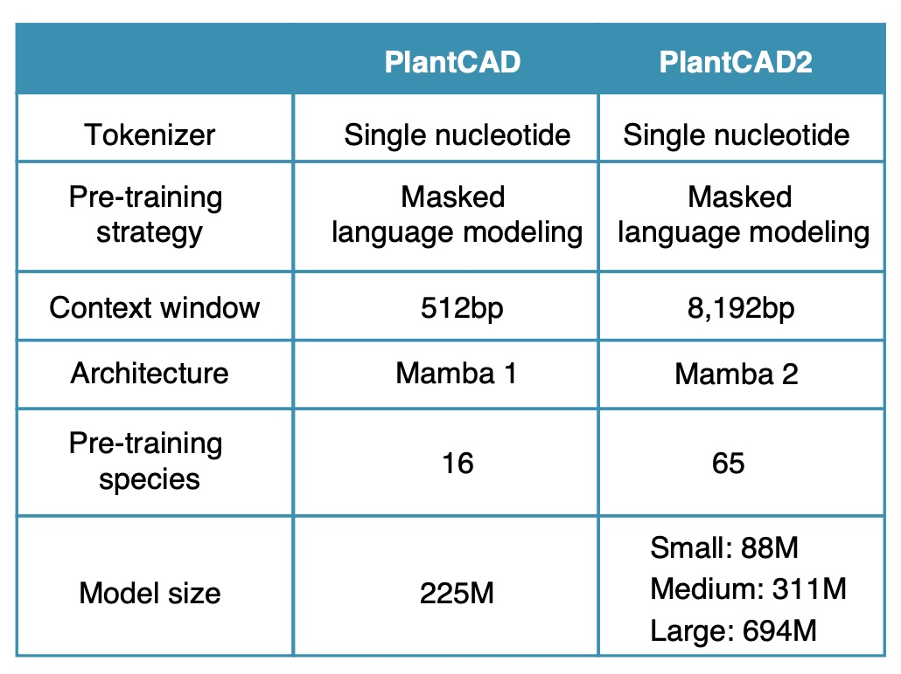

[](https://doi.org/10.1073/pnas.2421738122)
[](https://huggingface.co/collections/kuleshov-group/plantcad2-67e437e241a382671371a572)
<a href="https://huggingface.co/collections/kuleshov-group/plantcad2-67e437e241a382671371a572">

</a>

## Introduction
PlantCAD2 builds on the original [PlantCAD](https://doi.org/10.1073/pnas.2421738122) DNA language model, preserving its singlenucleotide tokenization and masked language modeling objective, while introducing four major improvements: architectural efficiency, context length, parameter scale, and phylogenetic breadth.

<p align="center">
  
</p>

## PlantCAD2 Model summary
Pre-trained PlantCAD models have been uploaded to [HuggingFace 🤗](https://huggingface.co/collections/kuleshov-group/plantcad2-67e437e241a382671371a572). Here's the summary of four PlantCAD models with different parameter sizes.

| Size | Base Model | Layers | Dimensions |
|------|------------|---------|------------|
| Small | [kuleshov-group/PlantCAD2-Small-l24-d0768](https://huggingface.co/kuleshov-group/PlantCAD2-Small-l24-d0768) | 24 | 768 |
| Medium | [kuleshov-group/PlantCAD2-Medium-l48-d1024](https://huggingface.co/kuleshov-group/PlantCAD2-Medium-l48-d1024) | 48 | 1024 |
| Large | [kuleshov-group/PlantCAD2-Large-l48-d1536](https://huggingface.co/kuleshov-group/PlantCAD2-Large-l48-d1536) | 48 | 1536 |

## Fine-tuning PlantCAD2 with LoRa
Here, we take accessible region prediction as an example.

#### Tokenize the data
```python
python ../src/lora_fine_tune.py tokenize \
    --hf_dataset "plantcad/PlantCAD2_fine_tuning_tasks" \
    --hf_config "cross_species_acr_train_on_arabidopsis" \
    --hf_split "train" \
    --sequence_length 600 \
    -output_path "train.parquet" \
    --model_name "kuleshov-group/PlantCAD2-Small-l24-d0768"
python ../src/lora_fine_tune.py tokenize \
    --hf_dataset "plantcad/PlantCAD2_fine_tuning_tasks" \
    --hf_config "cross_species_acr_train_on_arabidopsis" \
    --hf_split "validation" \
    --sequence_length 600 \
    -output_path "valid.parquet" \
    --model_name "kuleshov-group/PlantCAD2-Small-l24-d0768"
```

#### LoRa fine-tuning
```python
python ../src/lora_fine_tune.py train \
  --model_name "kuleshov-group/PlantCAD2-Small-l24-d0768" \
  --train_dir train.parquet \
  --valid_dir valid.parquet \
  --output_dir ./plantcad2-small-acr \
  --task_type "classification" \
  --train_batch_size 32 \
  --eval_batch_size 32 \
  --max_steps -1 \
  --seed 42 \
  --use_wandb True \
  --wandb_project test \
  --wandb_run_name "plantcad2-small-acr" \
  --learning_rate 1e-4 \
  --warmup_steps 50 \
  --lr_scheduler_type "linear" \
  --gradient_accumulation_steps 1 \ # adjust to make global batch size of 64 or higher
  --bf16 True \
  --num_train_epochs 1 \
  --weight_decay 0.01 \
  --eval_strategy "steps" \
  --eval_steps 250 \
  --save_strategy "steps" \
  --save_steps 250 \
  --logging_steps 250 \
  --remove_unused_columns False
```

## Available Fine-tuned Models
We also released a collection of [LoRA fine-tuned models](https://huggingface.co/collections/plantcad/fine-tuned-plantcad2-models-68b316a57616134fa7a1b6b6), tailored for key downstream tasks including accessible chromatin, gene expression, and protein translation.
| Task | Description | Small | Medium | Large |
|------|-------------|-------|--------|-------|
| **Cross-species ACR (Arabidopsis → 10 species)** | Predict accessible chromatin regions trained on Arabidopsis and transferred cross-species | [cross_species_acr_train_on_arabidopsis_plantcad2_small](https://huggingface.co/plantcad/cross_species_acr_train_on_arabidopsis_plantcad2_small) | [cross_species_acr_train_on_arabidopsis_plantcad2_medium](https://huggingface.co/plantcad/cross_species_acr_train_on_arabidopsis_plantcad2_medium) | [cross_species_acr_train_on_arabidopsis_plantcad2_large](https://huggingface.co/plantcad/cross_species_acr_train_on_arabidopsis_plantcad2_large) |
| **Cross-species ACR (9 species → 2 species)** | Multi-species training on nine species, tested on two | [cross_species_acr_train_on_nine_species_plantcad2_small](https://huggingface.co/plantcad/cross_species_acr_train_on_nine_species_plantcad2_small) | [cross_species_acr_train_on_nine_species_plantcad2_medium](https://huggingface.co/plantcad/cross_species_acr_train_on_nine_species_plantcad2_medium) | [cross_species_acr_train_on_nine_species_plantcad2_large](https://huggingface.co/plantcad/cross_species_acr_train_on_nine_species_plantcad2_large) |
| **Cell-type-specific ACR (Maize, hold-out chr10)** | Predict accessible chromatin across 92 maize cell types | [cell_type_specific_acr_plantcad2_small](https://huggingface.co/plantcad/cell_type_specific_acr_plantcad2_small) | [cell_type_specific_acr_plantcad2_medium](https://huggingface.co/plantcad/cell_type_specific_acr_plantcad2_medium) | [cell_type_specific_acr_plantcad2_large](https://huggingface.co/plantcad/cell_type_specific_acr_plantcad2_large) |
| **Cross-species leaf expression (On/Off, 15 Andropogoneae → 26 NAM genomes)** | Binary gene expression classification | [cross_species_leaf_on_off_expression_plantcad2_small](https://huggingface.co/plantcad/cross_species_leaf_on_off_expression_plantcad2_small) | [cross_species_leaf_on_off_expression_plantcad2_medium](https://huggingface.co/plantcad/cross_species_leaf_on_off_expression_plantcad2_medium) | [cross_species_leaf_on_off_expression_plantcad2_large](https://huggingface.co/plantcad/cross_species_leaf_on_off_expression_plantcad2_large) |
| **Cross-species leaf expression (Absolute, 15 Andropogoneae → 26 NAM genomes)** | Predict continuous gene expression levels | [cross_species_leaf_absolute_expression_plantcad2_small](https://huggingface.co/plantcad/cross_species_leaf_absolute_expression_plantcad2_small) | [cross_species_leaf_absolute_expression_plantcad2_medium](https://huggingface.co/plantcad/cross_species_leaf_absolute_expression_plantcad2_medium) | [cross_species_leaf_absolute_expression_plantcad2_large](https://huggingface.co/plantcad/cross_species_leaf_absolute_expression_plantcad2_large) |
| **Cross-species leaf translation (On/Off, Arabidopsis → Maize)** | Binary translation classification | [cross_species_leaf_on_off_translation_plantcad2_small](https://huggingface.co/plantcad/cross_species_leaf_on_off_translation_plantcad2_small) | [cross_species_leaf_on_off_translation_plantcad2_medium](https://huggingface.co/plantcad/cross_species_leaf_on_off_translation_plantcad2_medium) | [cross_species_leaf_on_off_translation_plantcad2_large](https://huggingface.co/plantcad/cross_species_leaf_on_off_translation_plantcad2_large) |
| **Cross-species leaf translation (Absolute, Arabidopsis → Maize)** | Predict continuous translation abundance | [cross_species_leaf_absolute_translation_plantcad2_small](https://huggingface.co/plantcad/cross_species_leaf_absolute_translation_plantcad2_small) | [cross_species_leaf_absolute_translation_plantcad2_medium](https://huggingface.co/plantcad/cross_species_leaf_absolute_translation_plantcad2_medium) | [cross_species_leaf_absolute_translation_plantcad2_large](https://huggingface.co/plantcad/cross_species_leaf_absolute_translation_plantcad2_large) |

## Usage Example
Let's still take accessible chromatin region prediction as an example:

#### Tokenize the data
```python
python src/lora_fine_tune.py tokenize \
    --hf_dataset "plantcad/PlantCAD2_fine_tuning_tasks" \
    --hf_config "cross_species_acr_train_on_arabidopsis" \
    --hf_split "test_sorghum_bicolor" \
    -output_path "sorghum.parquet" \
    --model_name "kuleshov-group/PlantCAD2-Small-l24-d0768"
```

#### Prediction
```python
python src/lora_fine_tune.py predict \
    --checkpoint_dir "plantcad/cross_species_acr_train_on_arabidopsis_plantcad2_small" --data_dir sorghum.parquet \
    --task_type "classification"
```
